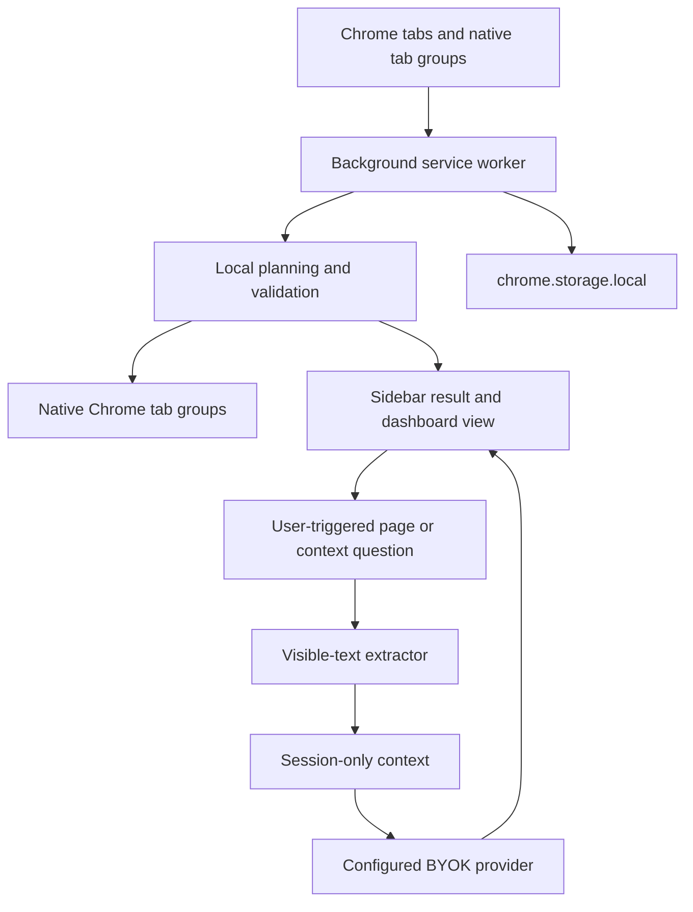

# Privacy Architecture Explainer

Status: PUBLIC EXPLAINER DRAFT  
Decision state: aligned with current implementation; review before using as final marketing/legal copy  
Last updated: 2026-06-12

## 1. One-Sentence Model

TabMosaic AI treats browser context as sensitive by default: it organizes tabs from minimized metadata first, reads page text only after a user asks, keeps local state local, and sends data only to the model provider the user configured.

## 2. What The Extension Does By Default

Default one-click Smart Organize uses tab metadata:

```text
tab title
hostname
URL path
active / pinned / audible / discarded state
window and native group state
duplicate-review signals
```

It does not read page bodies during one-click organize.

It does not collect:

```text
cookies
localStorage
sessionStorage
form values
password fields
hidden DOM
browser history
bookmarks
webRequest traffic
```

It does not request Chrome history, bookmarks, cookies, webRequest, browsingData, or incognito permissions.

## 3. Data Flow Overview



Important boundary:

```text
One-click organize does not read page text.
Page text extraction begins only after a user-triggered page/current-group/selected-tabs question or content-assisted regrouping request.
Browser-changing Agent actions require Apply.
```

## 4. AI Provider Boundary

TabMosaic uses an OpenAI-compatible request format.

Private beta default:

```text
DeepSeek
```

Supported BYOK direction:

```text
OpenAI-compatible HTTPS providers
OpenRouter
Groq
Together AI
Mistral AI
LM Studio
Ollama
custom HTTPS provider
http://localhost local model endpoint
```

Provider presets only fill Base URL and model fields. They do not save, test, enable AI, or request permissions until the user clicks Save or Test.

Remote provider rules:

```text
Remote providers must use HTTPS.
Remote providers require an API key.
Non-default provider origins require explicit Chrome origin permission.
Base URLs with username, password, query string, or hash are rejected.
```

Local endpoint rules:

```text
http://localhost style endpoints are allowed for local model servers.
Local endpoints may be used without an API key if the local server does not require auth.
When the API key is blank, TabMosaic sends no Authorization header.
```

## 5. Classification Payloads

Metadata classification may send minimized tab metadata to the configured provider:

```text
title
hostname
path
active / pinned / audible / discarded state
current group state
derived local features such as workflow, artifact type, and intent
```

It must not send:

```text
full URL
query string
hash
restore URL
favicon URL
cookies
form values
page body
browser history
saved workspace contents
cloud memory
```

AI output is validated before it can affect the browser. Invalid JSON, invented tab IDs, duplicate tab assignments, weak domain-only group names, or destructive close proposals are rejected or repaired before display/application.

## 6. Current Page Chat

Current-page chat reads visible text only after the user asks from the sidebar.

The page-chat payload may include:

```text
current tab title
hostname
visible text
selected text
headings
description
up to 10 local page-chat Q/A turns for follow-up resolution
```

It must not include:

```text
full URL
query string
hash
cookies
form values
hidden DOM
browser history
workspace memory
multi-tab page bodies
cloud storage data
```

Before upload, obvious API-key-like strings, bearer/JWT tokens, database connection strings, and full URLs are redacted best-effort.

Sensitive pages trigger an extra confirmation before reading visible text. Sensitive indicators include billing, bank, admin, password, database, Supabase, Stripe, AWS, Cloudflare, internal, medical, health, and localhost contexts.

## 7. Selected Tabs And Group Chat

Selected-tabs and current-group questions can read visible text only after the user initiates that scoped request.

The sidebar must show a compact tool card before extraction:

```text
tool name
scope
tab count
data type
storage boundary
skipped tabs
```

Private beta limits:

```text
maximum 6 tabs per batch
session-only extracted context
no persistent multi-tab page text
no cloud-synced summaries
restricted/internal/unreadable pages skipped
sensitive pages skipped or extra-confirmed
```

Optional site access is requested only for the specific origins involved in that user-triggered batch, then released after the answer when possible.

## 8. Local Storage

TabMosaic stores local state in `chrome.storage.local`.

Local state may include:

```text
latest organize result summary
Undo snapshot
Restore Closed snapshot
local rules
provider settings and local API key
saved workspace snapshots
redacted error log
duplicate close safety audit counts
first-run privacy acceptance
chat draft/session state
```

Local state should not include:

```text
page text
full URL in current run snapshots
URL hashes
favicon URLs
cloud summaries
chat history as cloud memory
diagnostic copies of real tab titles or hostnames
```

Restore Closed snapshots are the intentional local-only exception: they keep the minimum URL/title/window/index/group data needed to restore safely closed duplicate tabs. They are not included in diagnostics or feedback templates and are cleared by Restore Closed or Clear Local Data.

## 9. Diagnostics And Feedback

Dashboard diagnostics are local copy-only.

They may include:

```text
version
locale
permission names
latest run counts
duplicate counts
rule count
AI enabled/provider/model
privacy flags
redacted local error summaries
count-only duplicate safety audit
saved workspace count
```

They must not include:

```text
URLs
tab titles
hostnames
page text
group names
workspace names
rule patterns
emails
bearer tokens
API keys
private screenshots
```

GitHub issue templates repeat the same redlines and require submitters to confirm they reviewed content before submitting.

## 10. Browser-Changing Actions

Automation should stay reversible.

Rules:

```text
Smart Organize creates native Chrome tab groups.
Undo is saved before applying group changes.
Safe duplicate close keeps Restore Closed data.
Active, pinned, audible, incognito, and protected tabs must not be auto-closed.
AI action drafts require Apply before changing tabs.
AI must not close non-duplicate tabs.
```

## 11. What Is Not Implemented Yet

Not ready / not default:

```text
public Chrome Web Store launch
cloud sync
cloud workspace memory
hosted TabMosaic AI gateway
account login
billing
analytics upload
browser-history agent
automatic background page reading
unrestricted click/type/submit actions
```

Any move toward cloud storage, browsing analytics, broad host permissions, final paid limits, or public store submission remains confirmation-gated.

## 12. Verification

Relevant checks:

```bash
node tools/extension_smoke_test.js
node tools/issue_form_smoke_test.js
node tools/verify_release_package.js
node tools/beta_readiness_check.js
node tools/preflight.js
```

Optional runtime checks:

```bash
node tools/preflight.js --runtime
node tools/preflight.js --agent-flow
node tools/preflight.js --large-runtime
```

Current readiness state:

```text
READY_CONTROLLED_LOCAL_PRIVATE_BETA=yes
READY_PUBLIC_CHROME_WEB_STORE_LAUNCH=no
```

