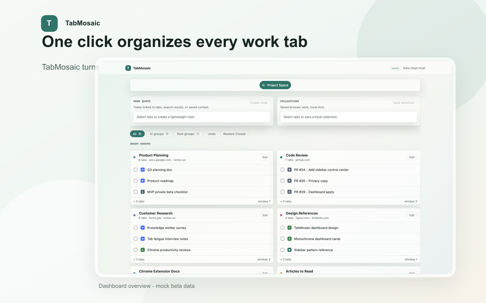
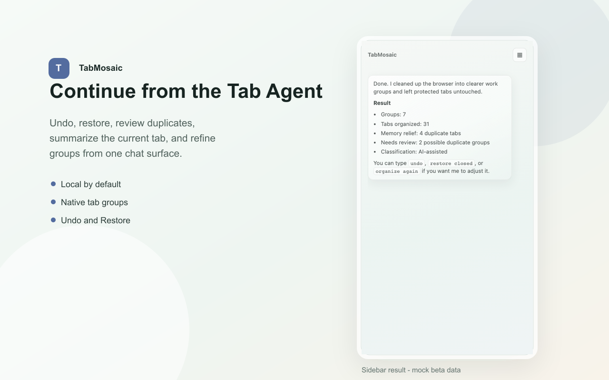
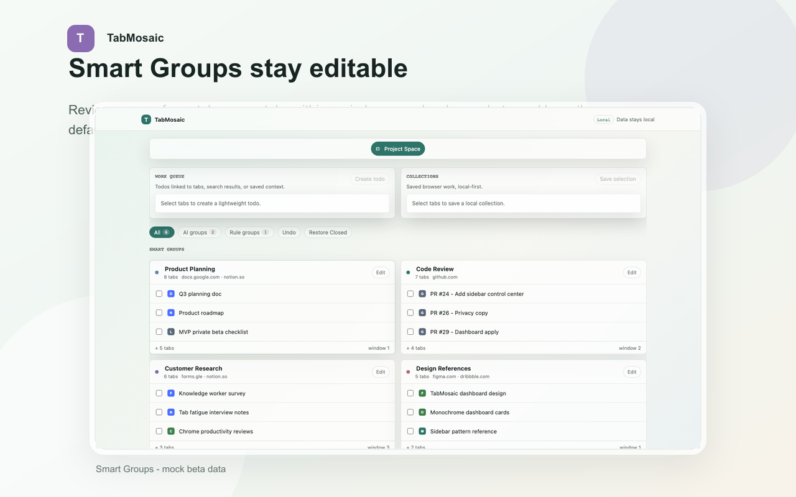
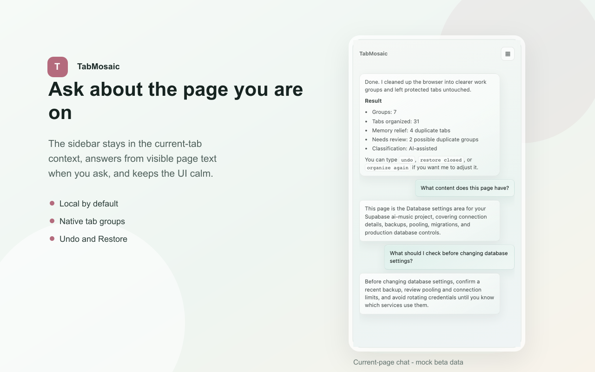
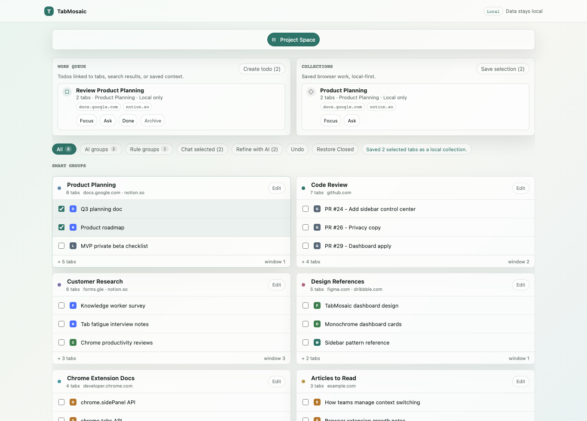
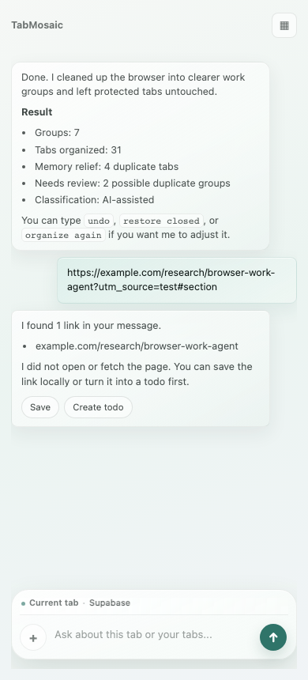
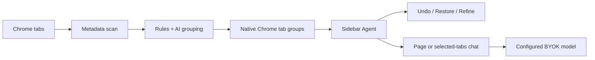

<div align="center">

# TabMosaic AI

### Open-source AI browser layer for Chrome

Turn tab overload into native Chrome tab groups, page chat, and browser work context with your own model.

[](https://github.com/tover0314-w/tabpilot/actions/workflows/ci.yml)
[](LICENSE)
[](extension/)
[](04_TECH/10_BYOK_PROVIDER_SETUP.md)
[](04_TECH/11_PRIVACY_ARCHITECTURE_EXPLAINER.md)

[Install from source](#install-from-source) ·
[How it works](#how-it-works) ·
[Privacy model](#privacy-model) ·
[Roadmap](#roadmap) ·
[Contribute](CONTRIBUTING.md)

</div>

> Working name note: `TabMosaic AI` is the current internal/open-source name. The final public brand/domain is still under review because `Tab Mosaic` already exists as a nearby Chrome Web Store name.

## Product Screenshots

All screenshots below use mock/synthetic beta data. No real tabs, URLs, page text, emails, API keys, or private browser profile data are included.

### One-click Smart Organize



### Sidebar Agent



### Editable Smart Groups Dashboard



### Current-page Chat



### Browser Workbench



### Link-to-work Flow



## Why This Exists

Most tab managers help after your browser is already messy. TabMosaic starts with the browser itself:

```text
Click extension icon
Choose Smart Organize
Get real Chrome native tab groups
Continue from the sidebar agent
```

The goal is not another passive chatbot. The goal is to make ordinary Chrome feel like an inspectable AI browser layer:

| Layer | What users get |
|---|---|
| Smart Organize | One-click grouping across normal Chrome windows using native tab groups |
| Sidebar Agent | A ChatGPT-like control layer for undo, review, page chat, selected-tabs chat, and follow-up actions |
| Browser Workbench | Tasks, saved collections, search/tool results, workspace snapshots, and tab context |
| BYOK Models | DeepSeek, OpenAI-compatible HTTPS providers, and local model endpoints such as Ollama/LM Studio |
| Privacy Controls | Metadata-first organization, user-triggered page reads, local state, redacted diagnostics |

## What It Can Do Today

- Organize all normal-window tabs into Chrome native tab groups.
- Classify by task/project/intent, not just by domain.
- Close only safe duplicate tabs and keep Undo / Restore available.
- Chat with the current page after a user-triggered page read.
- Ask about selected tabs, tab groups, or selected page regions with scoped tool disclosure.
- Preview content-assisted regrouping before applying browser changes.
- Save useful links/search results into local collections or local work tasks.
- Configure your own OpenAI-compatible provider or local model endpoint.

## Install From Source

Current status:

```text
READY_PUBLIC_SOURCE_RELEASE=yes
READY_PUBLIC_MARKETING_LAUNCH=no
READY_PUBLIC_CHROME_WEB_STORE_LAUNCH=no
```

This repo is public and source-release ready, but the extension is still a controlled local/private beta. It is not on the Chrome Web Store yet.

Run the local preflight:

```bash
node tools/preflight.js
```

Package the extension:

```bash
node tools/package_extension.js
```

Load it in Chrome:

```text
chrome://extensions
Turn on Developer mode
Load unpacked
Choose the extension/ directory
```

For a beginner-safe walkthrough, start with [Self-test guide](05_PROJECT/11_SELF_TEST_GUIDE.md). The real profile QA template is [真实 profile 脱敏 QA 模板](05_PROJECT/12_REAL_PROFILE_QA_RESULT_TEMPLATE.md).

## BYOK Model Setup

TabMosaic uses an OpenAI-compatible request shape.

Supported direction:

- DeepSeek as the private-beta default provider.
- OpenAI-compatible HTTPS providers such as OpenAI, OpenRouter, Groq, Together AI, Mistral AI, xAI, Perplexity, Cerebras, Fireworks AI, DeepInfra, SiliconFlow, Kimi / Moonshot, MiniMax, and DashScope / Qwen.
- Local endpoints such as Ollama and LM Studio through `http://localhost` OpenAI-compatible APIs.

Provider presets fill fields only. They do not test, enable AI, save keys, or request a provider origin until the user chooses Save or Test.

Read [BYOK provider setup](04_TECH/10_BYOK_PROVIDER_SETUP.md) and the shared [provider registry](extension/provider_registry.js).

## Privacy Model

Browser context is sensitive. The default design is intentionally narrow:

| Boundary | Default |
|---|---|
| One-click organize | Uses title, hostname, path, tab state, and group state |
| Page body text | Read only after the user asks a page/context question |
| Multi-tab text | User-triggered, capped, disclosed, session-only |
| Full URLs | Not sent to cloud AI by default |
| API keys | Stored locally for BYOK use |
| Browser-changing AI actions | Validated and Apply-gated |
| Diagnostics | Redacted, local copy-only |

TabMosaic does not request Chrome history, bookmarks, cookies, webRequest, browsingData, or incognito permissions by default.

Read the public [privacy architecture explainer](04_TECH/11_PRIVACY_ARCHITECTURE_EXPLAINER.md).

## How It Works



Key implementation files:

- [extension/manifest.json](extension/manifest.json)
- [extension/background.js](extension/background.js)
- [extension/page_quick_rail.js](extension/page_quick_rail.js)
- [extension/sidepanel.js](extension/sidepanel.js)
- [extension/dashboard.js](extension/dashboard.js)
- [extension/provider_registry.js](extension/provider_registry.js)
- [tools/extension_smoke_test.js](tools/extension_smoke_test.js)
- [tools/public_repo_audit.js](tools/public_repo_audit.js)
- [tools/launch_readiness_report.js](tools/launch_readiness_report.js)

## Highlights

- Native Chrome tab groups, not a fake in-app board.
- Smart Organize first, chat second.
- Open-source local extension under Apache-2.0.
- BYOK and local model friendly.
- Agent actions are validated before they touch the browser.
- Page-region context and selected-tabs context are already part of the product direction.
- Search is an agent tool, not a dashboard search box.
- Public issue forms are designed to avoid leaking browsing data.

## Docs By Goal

| Goal | Start here |
|---|---|
| Try it locally | [Self-test guide](05_PROJECT/11_SELF_TEST_GUIDE.md) |
| Understand the product | [PRD](01_PRODUCT/01_PRD.md), [Strategy](01_PRODUCT/02_PRODUCT_STRATEGY.md), [Aha moment](01_PRODUCT/04_AHA_MOMENT.md) |
| Understand the agent | [Sidebar Agent](02_FEATURE_SPECS/04_SIDEBAR_AGENT.md), [Tab Chat](02_FEATURE_SPECS/06_TAB_CHAT.md), [Agent tools](02_FEATURE_SPECS/12_AGENTIC_CLASSIFICATION_AND_CONTEXT_TOOLS.md), [AI browser expansion](02_FEATURE_SPECS/15_AI_BROWSER_RELEVANT_FEATURE_EXPANSION.md) |
| Configure models | [BYOK provider setup](04_TECH/10_BYOK_PROVIDER_SETUP.md), [AI provider strategy](04_TECH/05_AI_PROVIDER_STRATEGY.md) |
| Review privacy | [Privacy architecture](04_TECH/11_PRIVACY_ARCHITECTURE_EXPLAINER.md), [Privacy controls](02_FEATURE_SPECS/11_PRIVACY_CONTROLS.md), [Security implementation](04_TECH/07_SECURITY_PRIVACY_IMPLEMENTATION.md) |
| Review monetization | [Paywall and billing](02_FEATURE_SPECS/10_PAYWALL_BILLING.md), [competitor pricing research](06_REFERENCES/04_COMPETITOR_PRICING_RESEARCH.md) |
| Contribute | [Contributing](CONTRIBUTING.md), [Issue forms](.github/ISSUE_TEMPLATE/) |
| Follow launch readiness | [Public launch packet](05_PROJECT/16_PUBLIC_LAUNCH_DECISION_PACKET.md), [Public repo cleanup](05_PROJECT/17_PUBLIC_REPO_CLEANUP_CHECKLIST.md) |

The full harness map is in [INDEX.md](INDEX.md).

## Roadmap

### Now

- Local/private beta.
- Public source release.
- Smart Organize, Sidebar Agent, Dashboard workbench, BYOK provider presets.

### Next

- Stronger content-assisted classification quality.
- Better multi-tab / tab-group reasoning.
- More useful built-in browser-work workflows.
- Final public brand/domain decision.
- Real-profile QA before any Chrome Web Store submission.

### Later

- Optional hosted AI.
- Optional account and sync.
- Long-term memory/workspace services.
- Team or managed plans.

## Contributing

Good first areas:

- Provider presets and setup docs.
- Grouping-quality examples with synthetic tab data.
- Safer classification rules.
- Sidebar and dashboard UI polish.
- Prompt/schema validation.
- Privacy test coverage.

Please read [CONTRIBUTING.md](CONTRIBUTING.md) before opening issues or PRs. Do not include real tab titles, full URLs, page text, API keys, emails, private screenshots, or browser profile data in public issues.

## Repo Operations

Default preflight:

```bash
node tools/preflight.js
```

Useful focused checks:

```bash
node tools/secret_scan.js
node tools/public_repo_audit.js
node tools/launch_readiness_report.js
node tools/final_launch_gate_check.js --include-remote-ci --allow-blocked
node tools/launch_readiness_report.js --template-only
node tools/prepare_public_launch_handoff_packet.js --self-test
node tools/real_profile_qa_redaction_check.js --self-test
node tools/prepare_real_profile_qa_packet.js --self-test
node tools/prepare_store_asset_review_packet.js --self-test
node tools/provider_registry_check.js
node tools/issue_form_smoke_test.js
node tools/extension_smoke_test.js
node tools/beta_readiness_check.js
```

Current expected public audit:

```text
READY_PUBLIC_SOURCE_RELEASE=yes
READY_PUBLIC_REPO_PUSH=yes
READY_PUBLIC_MARKETING_LAUNCH=no
READY_PUBLIC_CHROME_WEB_STORE_LAUNCH=no
PUBLIC_SOURCE_RELEASE_BLOCKERS=none
```

## Star History

[](https://www.star-history.com/#tover0314-w/tabpilot&Date)

## License

Apache-2.0. See [LICENSE](LICENSE).
